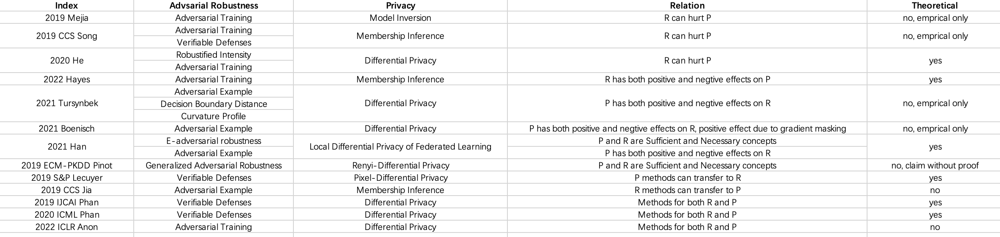

# A Paper Summary for Relations between Trustworthy AI Concepts

This is a paper summary for relations between trustworthy AI concepts, including
- Utility (base)
- OOD Generalization
- Adversarial Robustness
- Privacy
- Fairness
- Interpretability
- ...

---

## Utility v.s. OOD Generalization
- 2020 ICML - Harder or Different? A Closer Look at Distribution Shift in Dataset Reproduction
- 2021 ICML - Accuracy on the Line: On the Strong Correlation Between Out-of-Distribution and In-Distribution Generalization

## Utility v.s. Adversarial Robustness

### Difference between Robustness Generalization & Standard Generalization
- 2018 NIPS - PAC-learning in the presence of evasion adversaries
- 2018 NIPS - Adversarially Robust Generalization Requires More Data
- 2019 ICML - Rademacher Complexity for Adversarially Robust Generalization
- 2019 ICML - Adversarial Examples from Computational Constraints
- 2019 COLT - VC Classes are Adversarially Robustly Learnable, but Only Improperly
- 2020 ICLR - Adversarially Robust Generalization Just Requires More Unlabeled Data

### Tradeoff between Robustness & Utility
- 2016 ICMLA - Are Accuracy and Robustness Correlated?
- 2018 ECCV - Is Robustness the Cost of Accuracy? A Comprehensive Study on the Robustness of 18 Deep Image Classification Models
- 2018 ICLR - Towards Deep Learning Models Resistant to Adversarial Attacks
- 2018 Gilmer - The Relationship Between High-Dimensional Geometry and Adversarial Examples
- 2019 ICLR - Robustness May Be at Odds with Accuracy
- 2019 NIPS - Adversarial Examples Are Not Bugs, They Are Features
- 2019 ICML - Theoretically Principled Trade-off between Robustness and Accuracy
- 2019 ICML - Adversarial Training Can Hurt Generalization
- 2019 Nakkiran - Adversarial robustness may be at odds with simplicity
- 2019 CVPR - Disentangling Adversarial Robustness and Generalization
- 2019 ICML - Adversarial Training Can Hurt Generalization
- 2020 ICML - Understanding and Mitigating the Tradeoff Between Robustness and Accuracy
- 2020 ICML - More Data Can Expand the Generalization Gap Between Adversarially Robust and Standard Models
- 2020 COLT - Precise Tradeoffs in Adversarial Training for Linear Regression
- 2020 NIPS - A Closer Look at Accuracy vs. Robustnes
- 2021 UAI - The Curious Case of Adversarially Robust Models: More Data Can Help, Double Descend, or Hurt Generalization
- 2022 ICML - Robustness and Accuracy Could Be Reconcilable by (Proper) Definition

## Utility v.s. Privacy

## Utility v.s. Fairness

---
## OOD Generalization v.s. Adversarial Robustness
- 2021 ICML Yi - Improved OOD Generalization via Adversarial Training and Pre-training
- 2022 Gokhale - Generalized but not Robust? Comparing the Effects of Data Modification Methods on Out-of-Domain Generalization and Adversarial Robustness

## OOD Generalization v.s. Privacy

- 2018 CSFS - Privacy risk in machine learning: Analyzing the connection to overfitting
- 2019 IJCAI - Differentially Private Optimal Transport: Application to Domain Adaptation
- 2020 ICML - Alleviating privacy attacks via causal learning
- 2021 - The Connection between Out-of-Distribution Generalization and Privacy of ML Models

## OOD Generalization v.s. Fairness
- 2020 - Fairness and Robustness in Invariant Learning: A Case Study in Toxicity Classification
- 2021 - Exchanging Lessons Between Algorithmic Fairness and Domain Generalization

---

## Robustness v.s. Privacy based on Utility

- 2019 Mejia - Robust or Private? Adversarial Training Makes Models More Vulnerable to Privacy Attacks
- 2019 CCS Song - Privacy Risks of Securing Machine Learning Models against Adversarial Examples
- 2019 ECM-PKDD Pinot - A unified view on differential privacy and robustness to adversarial examples
- 2019 S&P Lecuyer - Certified Robustness to Adversarial Examples with Differential Privacy
- 2019 CCS Jia - MemGuard: Defending against Black-Box Membership Inference Attacks via Adversarial Examples
- 2019 IJCAI Phan - Heterogeneous Gaussian Mechanism: Preserving Differential Privacy in Deep Learning with Provable Robustness
- 2020 ICML Phan - Scalable Differential Privacy with Certified Robustness in Adversarial Learning
- 2020 He - Robustness, Privacy, and Generalization of Adversarial Training
- 2021 Han - Understanding the Interplay between Privacy and Robustness in Federated Learning
- 2021 Tursynbek - Robustness Threats of Differential Privacy
- 2021 Boenisch - Gradient Masking and the Underestimated Robustness Threats of Differential Privacy in Deep Learning
- 2022 Hayes - Trade-offs between membership privacy & adversarially robust learning
- 2022 ICLR Anon - Practical Adversarial Training with Differential Privacy for Deep Learning

## Robustness v.s. Fairness based on Utility

- 2021 ICML Xu - To be Robust or to be Fair: Towards Fairness in Adversarial Training
- 2020 Chang - On Adversarial Bias and the Robustness of Fair Machine Learning
- 2022 S&P Sun - Towards Fair and Robust Classification
- 2020 Sharma - FaiR-N: Fair and Robust Neural Networks for Structured Data
- 2020 Roh - FR-Train: A Mutual Information-Based Approach to Fair and Robust Training

## Privacy v.s. Fairness based on Utility
- Fairness Through Awareness
- 2019 NIPS Bagdasaryan - Differential privacy has disparate impact on model accuracy
- 2019 On the Compatibility of Privacy and Fairness
- 2019 ICML - Differentially Private Fair Learning
- 2020 FAT Pujol - Fair Decision Making Using Privacy-Protected Data
- 2020 Xu - Removing Disparate Impact of Differentially Private Stochastic Gradient Descent on Model Accuracy
- 2021 NIPS - Differentially Private Empirical Risk Minimization under the Fairness Lens
- 2021 IJCAI  Fioretto - Decision Making with Differential Privacy under a Fairness Lens
- 2021 S&P Chang - On the Privacy Risks of Algorithmic Fairness
- 2021 AAAI - Improving Fairness and Privacy in Selection Problems

